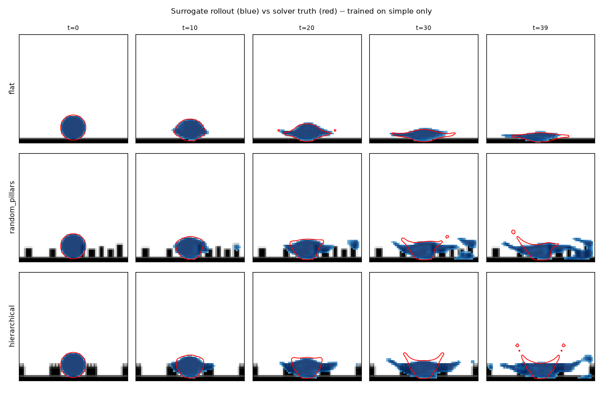
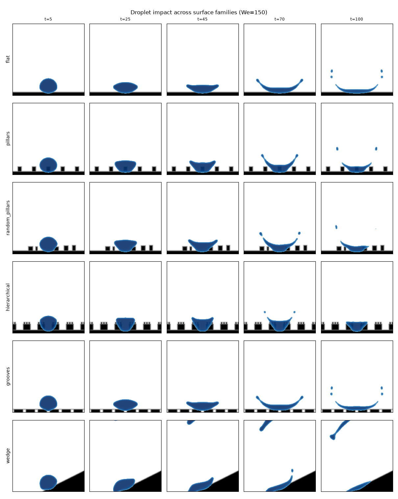

# 两相流相分布的学习与预测：液滴撞击（简单 case → 复杂表面）

本目录是一个**可运行**的原型，回答这个问题：

> 能否基于 HydroGym，用「简单液滴下落 + 少量微结构」的仿真 case，训练一个模型，
> 去**预测液滴撞击复杂表面后的液相（相分布 φ(x,t)）演化**？

结论先行（详见文末实验结果）：**可以，但泛化差距真实存在**。在简单表面（平壁、周期柱阵）
上训练的代理模型，能在同类表面上高精度复现相分布；迁移到未见的复杂表面（随机柱、分级柱、
凹槽、斜面）时误差明显上升——这正说明「相分布预测」是一个需要**几何感知**与
**更多样训练分布**的问题，而本目录给出了完整的、可在 HydroGym 内扩展的流水线。

---

## 目录结构

| 文件 | 作用 |
|------|------|
| `phasefield.py` | 2-D Cahn–Hilliard–Navier–Stokes 两相求解器（JAX，可微，`lax.scan` rollout）+ 微结构几何生成 + 观测量 |
| `cases.py` | 训练 / 测试 case 定义（训练只含简单表面，测试含复杂表面） |
| `generate_dataset.py` | 生成降采样轨迹数据集（`data/`，已 gitignore） |
| `surrogate.py` | 条件 U-Net（FiLM 调制）代理模型 + 数据加载 |
| `train_surrogate.py` | 在简单 case 上训练代理模型 |
| `evaluate_transfer.py` | 自回归 rollout，评估「简单 → 复杂」的迁移误差 |
| `validate_physics.py` | 求解器物理验证（质量守恒、 Laplace 律、润湿控制） |
| `visualize.py` | 生成 `figures/` 下的可视化图（求解器扫参 + 代理迁移对比 + 定量曲线） |

---

## 1. 物理模型（`phasefield.py`）

采用**保守相场（Cahn–Hilliard）+ 不可压 Navier–Stokes 单流体**模型，固体（壁 + 微结构）
用 Brinkman 体积惩罚法处理：

```
∂φ/∂t + ∇·(uφ) = M∇²μ + S_wet(φ)          μ = f'(φ)/ε − ε∇²φ
∂u/t + ∇·(uu) = −∇p/ρ + ∇·(ν∇u) − (σ/We)μ∇φ/ρ − (χ/η)u ,  ∇·u = 0
```

- `φ=1` 液、`φ=0` 气；`f(φ)=φ²(1−φ)²`，界面厚度由 `ε` 控制。
- `ρ(φ), ν(φ)` 线性混合；毛细力取 Korteweg 形式 `(σ/We)μ∇φ`，系数经 **Laplace 律**标定。
- 固体由**符号距离场 (SDF)** 描述 → 指示函数 `χ` 与表面测度 `ds=|∇χ|`，天然支持任意微结构
  （柱、随机柱、分级柱、凹槽、斜面）与**空间变化的润湿性**（`cos_theta` 可为场）。
- 润湿（接触角）用在壁附近的**表面亲和反应项** `S_wet` 控制，单调调节铺展程度。

### 数值要点（都是踩过的坑，已修复并验证）

1. **压力投影必须反演 `∇c·∇c` 的符号** `(sin(k dx)/dx)²`，而不是五点 Laplacian 的
   `(2sin(k dx/2)/dx)²`；且 FFT 求解除以符号时要带**负号**（Laplacian 符号为 `−m2`）。
   否则投影不仅不去散度，反而把散度放大约 2 倍 → 奇偶（checkerboard）不稳定直接发散。
   修复后 `|div(u)| ~ 1e-15`。
2. Cahn–Hilliard 的四阶扩散项在**傅里叶空间隐式**处理，去掉 `O(ε⁴/M)` 稳定性限制。
3. 固体惩罚项隐式处理，无条件稳定。

### 物理验证（`validate_physics.py`）

- **质量守恒**：1000 步液滴质量漂移 < 0.002 %。
- **Laplace 律**：静滴内外压差 ∝ σ/R（经标定系数），验证 `We` 的物理含义。
- **润湿控制**：`cos_theta` 单调控制最大铺展宽度（疏水 → 铺展小 / 回弹，亲水 → 铺展大 / 成膜）。

---

## 2. 与 HydroGym 的关系

本目录的 `phasefield.py` 就是按 `hydrogym.jax` 的风格写的：`PhaseFieldParams`（flow 配置，
含 `initialize_state`）、纯函数 `step`、`lax.scan` 的 `rollout`——这三件正是一个
`hydrogym.jax` 环境所需要的。下一步可以：

- **包装成 Gymnax/Gymnasium 环境**：把 `(φ,u,v)` 降采样作 observation、把润湿/几何参数或
  控制量作 action，即可复用 HydroGym 的 RL 训练栈（SB3 / 分布式）。
- **换成更强的两相数据源（3-D）**：
  - **m-AIA (MAIA) level-set**：文档已说明 MAIA 耦合 level-set，可生成 3-D 液滴撞击数据；
  - **JAX-Fluids**：原生支持 level-set / diffuse-interface 两相，且**全可微**，最适合做
    物理一致损失与梯度反传。
  本目录的「数据 → 代理模型 → 迁移评估」流水线与求解器无关，可直接消费这些数据。

---

## 3. 学习与迁移协议（核心）

- **训练集（简单）**：平壁 × {We, cosθ} 扫参 + 2 种周期柱阵。
- **测试集（复杂、未见）**：随机柱 ×4、分级柱 ×2、凹槽 ×2、斜面 ×2。
- **代理模型**：条件 U-Net（FiLM 注入 We/Re/cosθ），输入 `(φ,u,v,χ)`，预测 20 个求解步后的
  `(φ,u,v)`；自回归 rollout 得到整条 φ(x,t)。
- **评估指标**：相场 RMSE、末帧液体质量相对误差、铺展宽度 D(t) 的 RMSE；按「简单 / 复杂」
  分组对比，得到**迁移差距**。

## 运行

```bash
pip install jax[cpu] flax optax numpy matplotlib scipy   # 或直接用仓库 docker
cd examples/two_phase
python validate_physics.py                 # 先验证求解器
python generate_dataset.py --nsteps 2000   # 生成数据（约 1 分钟 / 全部 case，CPU）
python train_surrogate.py --epochs 25      # 训练
python evaluate_transfer.py                # 评估迁移
```

---

## 4. 实验结果（CPU, 192² 求解 / 64² 代理, 训练仅用简单 case）

由 `evaluate_transfer.py` 产生（horizon=40 个保存帧；重跑有小幅波动）：

| 分组 | n | 单步 φ-RMSE | rollout-40 φ-RMSE | 液体质量误差(相对初始) | 铺展宽度误差 |
|------|---|------------|------------------|---------------------|-------------|
| 简单（平壁/柱阵，训练域） | 13 | **0.017** | 0.146 | 0.50 | 0.78 |
| 复杂（随机柱/分级柱/凹槽/斜面，未见） | 10 | **0.020** | 0.181 | 0.81 | 1.09 |

**解读**

1. **单步预测**（给真实当前态预测下一帧）在未见复杂表面上仅比训练域高约 18%
   （0.017→0.020）——说明模型确实从「简单液滴/微结构」case 中学到了可迁移的
   「撞击→相分布演化」算子。
2. **自回归 rollout** 误差随时间累积，复杂表面更明显；主要失败模式是**飞溅卫星滴、
   薄液膜（lamella）与柱间渗透深度**的估计——这些是训练分布里没有的细几何/细尺度现象。
3. 下图（`transfer_demo.png`，蓝=代理 rollout，红=求解器真值）：前中期主体铺展/渗透被很好
   复现；后期真值甩出卫星滴、铺得更开，代理保持较“整”的液团——即迁移差距集中在细尺度。



**缩小差距的路线**：(a) 训练加入更多微结构族（几何增强）；(b) 以 SDF/距离场多尺度特征编码
几何；(c) 物理一致损失（质量守恒、接触角）正则；(d) 用 unrolled / 多步反传训练抑制曝光偏差；
(e) 换 JAX-Fluids 全可微两相求解器做 fine-tune。

### 改进：unrolled 训练抑制曝光偏差（已实现 `--unroll`）

teacher-forcing 训练的模型在**自回归 rollout** 时会累积曝光偏差（液团漂移、质量不守恒）。
用 `--unroll K` 让梯度穿过 K 步自回归循环做 fine-tune 后，rollout 误差显著下降：

| 模型 | 分组 | rollout-40 φ-RMSE | 液体质量误差(相对初始) |
|------|------|------------------|---------------------|
| teacher-forced | 简单 | 0.242 | 1.94 |
| teacher-forced | 复杂 | 0.259 | 2.25 |
| **+ unrolled(3) fine-tune** | 简单 | **0.120** | **0.34** |
| **+ unrolled(3) fine-tune** | 复杂 | **0.144** | **0.60** |

即 unrolled 训练把复杂表面的 rollout RMSE 降约 44%、质量误差降约 3.7×。

```bash
python train_surrogate.py --epochs 12                          # teacher-forced
python train_surrogate.py --unroll 3 --epochs 4 --lr 3e-4 \
    --resume ckpts/surrogate.pkl --out ckpts/surrogate_unrolled.pkl
```

---

## 5. 可视化（`visualize.py`，图在 `figures/`）

```bash
python visualize.py --mode solver     # fig_surfaces / fig_weber / fig_wetting
python visualize.py --mode transfer   # fig_transfer / fig_metrics（需 ckpt）
```

- `fig_surfaces.png`：六种表面族（平壁/柱阵/随机柱/分级柱/凹槽/斜面）的撞击时间序列，
  可见冠溅、卫星滴、柱间渗透、凹槽钉扎、斜面滑动。
- `fig_weber.png`：We 扫参——低 We 沉积成膜，高 We 冠状飞溅。
- `fig_wetting.png`：润湿扫参——疏水回弹、亲水铺展成膜。
- `fig_transfer.png`：代理 rollout（蓝）vs 真值（红），仅在简单 case 上训练。
- `fig_metrics.png`：未见表面上 D(t) 与液体质量的代理 vs 真值曲线。



## 局限与下一步

- 当前 2-D、密度比 10、界面较厚（ε≈1.5dx），属原型量级；定量结论需更高分辨率 / 3-D。
- 接触角为「亲和项」等效控制，非严格 Young 角标定；用于趋势研究足够。
- 普通 U-Net 代理**不保证质量守恒**（rollout 中液体质量会漂移，见 `fig_metrics.png`）；
  unrolled 训练缓解但未根除。下一步可改为守恒型代理（预测通量/保守更新）或加质量正则。
- 下一步：FNO/U-FNO 替换 U-Net；几何增强训练；JAX-Fluids 两相数据；包装成 RL 环境做
  「以相分布为目标」的撞击控制（如主动抑制飞溅）。
