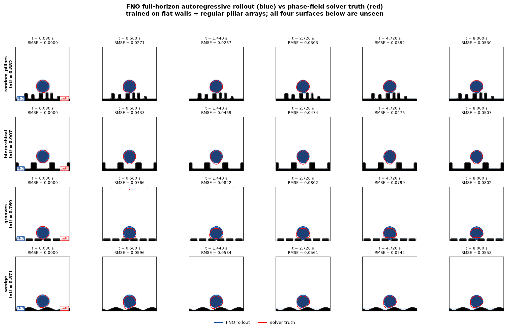
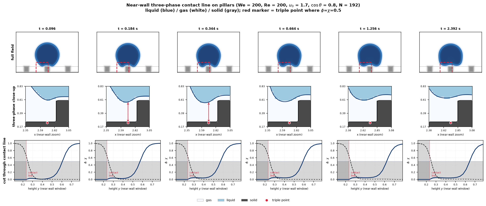
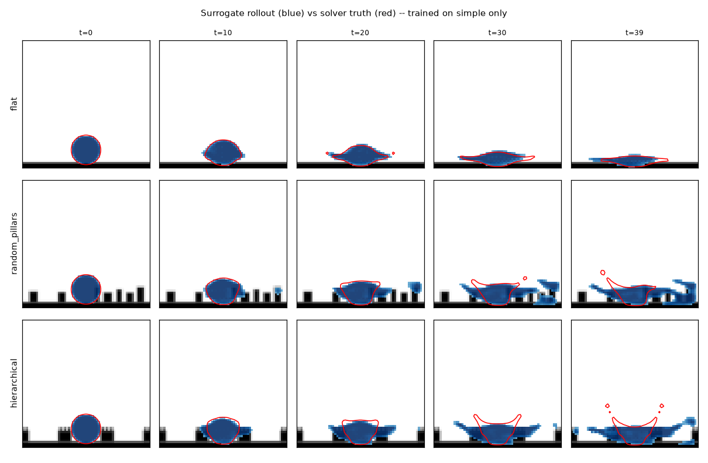
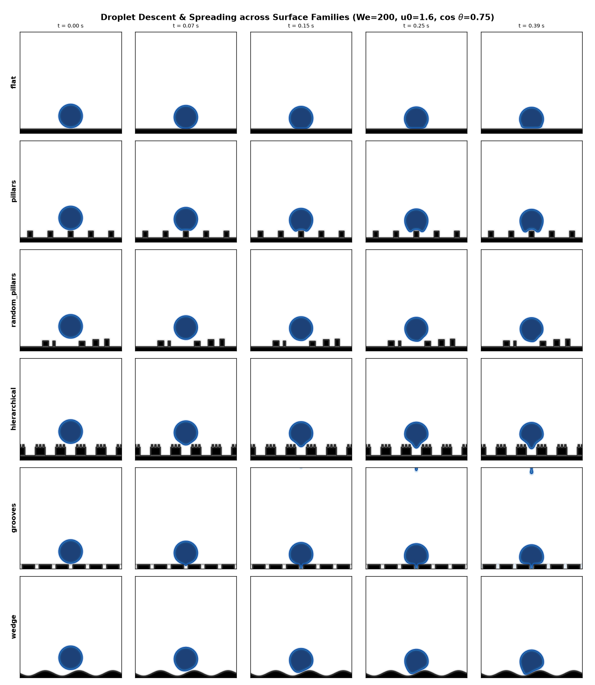

# 两相流相分布的学习与预测：液滴撞击（简单 case → 复杂表面）

> **L0/development status.** The current JAX solver and tiny FNO runs are
> regression, dataset-contract, and deterministic CPU diagnostics only. They
> are **not publication-quality CFD evidence**, and they do not validate
> geometry generalization for publication. `run_smoke.sh` is the CI entry point
> for the eight-case L0 pipeline; `run_experiments.sh` is development-scale,
> not a production training recipe. Production data and training will run
> locally on GPU/HPC later.

本目录是一个**可运行**的原型，回答这个问题：

> 能否基于 HydroGym，用「简单液滴下落 + 少量微结构」的仿真 case，训练一个模型，
> 去**预测液滴撞击复杂表面后的液相（相分布 φ(x,t)）演化**？

结论先行：当前结果只说明数据、模型、评估和回归契约可以在 CPU 上运行；它们**不构成**
出版级 CFD 或几何泛化证据。历史实验表格保留作诊断记录，不能替代更高分辨率、验证过的
生产数据。这个目录提供的是可在 HydroGym 内扩展的 L0/development 流水线。

---

## 目录结构

| 文件 | 作用 |
|------|------|
| `phasefield.py` | 2-D Cahn–Hilliard–Navier–Stokes 两相求解器（JAX，可微，`lax.scan` rollout）+ 微结构几何生成 + 观测量 |
| `cases.py` | 训练 / 测试 case 定义（训练只含简单表面，测试含复杂表面） |
| `generate_dataset.py` | 生成降采样轨迹数据集（`data/`，已 gitignore） |
| `surrogate.py` | FNO / U-Net、SDF 多尺度几何编码、有界质量投影与数据指纹 |
| `train_operator.py` | teacher-forced / guarded-unroll FNO 训练；checkpoint 与数据指纹强绑定 |
| `evaluate_transfer.py` | full-horizon 迁移评估、逐表面指标、raw-mass 与投影工作量诊断 |
| `test_two_phase.py` | 求解器守恒、压力投影、壁面/几何回归测试 |
| `test_surrogate.py` | 代理质量投影与 straight-through 梯度回归测试 |
| `visualize.py` | 求解器图、严格 test-only/full-horizon 迁移图与分辨率图 |
| `make_impact_visualization.py` | 六种表面的下落–撞击–铺展全过程图与 GIF |
| `make_contact_closeup.py` | 近壁面三相接触线微观特写（无需 checkpoint） |
| `make_regression_visualization.py` | FNO 在 4 种未见壁面上的 full-horizon 自回归回归图 |

---

## 1. 物理模型（`phasefield.py`）

采用**保守相场（Cahn–Hilliard）+ 不可压 Navier–Stokes 单流体**模型，固体（壁 + 微结构）
用 Brinkman 体积惩罚法处理：

```
∂φ/∂t + ∇·(uφ) = M∇²μ
μ = f'(φ)/ε − ε∇²φ + μ_wet(φ,SDF)
∂u/t + ∇·(uu) = −∇p/ρ + ∇·(ν∇u) − (σ/We)μ∇φ/ρ − (χ/η)u ,  ∇·u = 0
```

- `φ=1` 液、`φ=0` 气；`f(φ)=φ²(1−φ)²`，界面厚度由 `ε` 控制。
- `ρ(φ), ν(φ)` 线性混合；毛细力取 Korteweg 形式 `(σ/We)μ∇φ`，系数经 **Laplace 律**标定。
- 固体由**符号距离场 (SDF)** 描述 → 指示函数 `χ` 与表面测度 `ds=|∇χ|`，天然支持任意微结构
  （柱、随机柱、分级柱、凹槽、斜面）与**空间变化的润湿性**（`cos_theta` 可为场）。
- 润湿（接触角）用在壁附近的**表面亲和反应项** `S_wet` 控制，单调调节铺展程度。

### 数值要点（都是踩过的坑，已修复并验证）

1. **压力投影必须反演 `∇c·∇c` 的符号** `(sin(k dx)/dx)²`，而不是五点 Laplacian 的
   `(2sin(k dx/2)/dx)²`；且 FFT 求解除以符号时要带**负号**（Laplacian 符号为 `−m2`）。
   否则投影不仅不去散度，反而把散度放大约 2 倍 → 奇偶（checkerboard）不稳定直接发散。
   修复后 `|div(u)| ~ 1e-15`。
2. Cahn–Hilliard 的四阶扩散项在**傅里叶空间隐式**处理，去掉 `O(ε⁴/M)` 稳定性限制。
3. 固体惩罚项隐式处理，无条件稳定。

### 自动回归验证

可复现检查位于 `test_two_phase.py`、`test_surrogate.py`、`test_dataset_contract.py` 和
`test_train_operator.py`，统一由 `pytest` 执行。压力投影显式屏蔽 centred-difference 的
Nyquist 零模；数据生成在写盘前检查守恒、固体泄漏、相场越界和微结构可解析性。

---

## 2. 与 HydroGym 的关系

本目录的 `phasefield.py` 就是按 `hydrogym.jax` 的风格写的：`PhaseFieldParams`（flow 配置，
含 `initialize_state`）、纯函数 `step`、`lax.scan` 的 `rollout`——这三件正是一个
`hydrogym.jax` 环境所需要的。下一步可以：

- **包装成 Gymnax/Gymnasium 环境**：把 `(φ,u,v)` 降采样作 observation、把润湿/几何参数或
  控制量作 action，即可复用 HydroGym 的 RL 训练栈（SB3 / 分布式）。
- **换成更强的两相数据源（3-D）**：
  - **m-AIA (MAIA) level-set**：文档已说明 MAIA 耦合 level-set，可生成 3-D 液滴撞击数据；
  - **JAX-Fluids**：原生支持 level-set / diffuse-interface 两相，且**全可微**，最适合做
    物理一致损失与梯度反传。
  本目录的「数据 → 代理模型 → 迁移评估」流水线与求解器无关，可直接消费这些数据。

---

## 3. 学习与迁移协议（核心）

- **训练集（简单）**：平壁 × {We, cosθ} 扫参 + 2 种周期柱阵。
- **测试集（复杂、未见）**：随机柱 ×4、分级柱 ×2、凹槽 ×2、斜面 ×2。
- **代理模型**：FNO + 局部卷积分支，输入 `(φ,u,v)` 与 SDF 多尺度几何特征；We/Re/cosθ 由
  FiLM 注入。low-We 正式协议使用 192² solver → 96² surrogate（`ds=2`），避免 hierarchical
  微结构在 64² 网格上消失。
- **评估指标**：one-step RMSE、严格 K-step 与 full-horizon RMSE、IoU、铺展宽度，以及
  **投影前 raw mass error / projection L1**。投影后的 mass error 只用于检查约束器，不再当成
  网络自身学会守恒的证据。

## 运行

The supported CI smoke entry point is deliberately small and CPU-only:

```bash
cd examples/two_phase
JAX_PLATFORMS=cpu bash run_smoke.sh
# Optional: exercise the resume/unroll path with a few additional steps.
SMOKE_UNROLL=1 bash run_smoke.sh
```

It creates only ignored files below `artifacts/smoke/`, verifies the complete
manifest, runs a kinematic check, trains a width-8/two-layer FNO for about 20
steps, and evaluates persistence plus the model for five saved frames. A
negative smoke skill is allowed: this is a pipeline test, not a model
performance benchmark.

```bash
cd examples/two_phase
pytest test_two_phase.py test_surrogate.py test_dataset_contract.py test_train_operator.py

# schema v3 + exact fingerprint; old schema-v2 data/checkpoint fails closed
bash run_experiments.sh

# 高惯性撞击 / 动态铺展数据集（spreading）+ FNO 回归评测
python generate_dataset.py --set spreading --out data/spreading --nsteps 2000 --ds 3
python train_operator.py --data data/spreading --arch fno --geom sdf \
    --steps 2500 --out ckpts/fno_spreading.pkl
python make_regression_visualization.py --data data/spreading \
    --ckpt ckpts/fno_spreading.pkl

# 近壁面三相接触线特写（只用求解器，不需要 checkpoint）
python make_contact_closeup.py
```

---

## 3b. 高惯性铺展数据集与 FNO 回归评测（`spreading`）

`spreading` case 集专门针对**高惯性撞击 + 动态铺展**：训练只用平壁与规则柱阵，
测试保留 4 种未见复杂几何（随机柱、分级柱、凹槽、斜面），全部使用 `u_impact=1.6~1.7`
的高惯性初速与 `dt=2e-3`：

| split | surface | We | cosθ | u_impact |
|-------|---------|----|------|----------|
| train | flat | 150 / 200 / 250 / 200 | -0.5 / 0.0 / 0.5 / 0.8 | 1.6 / 1.7 |
| train | pillars (4/5/6 柱) | 150 / 200 / 250 / 220 | -0.5 / 0.0 / 0.5 / 0.8 | 1.6 / 1.7 |
| test | random_pillars (seed 102) | 200 | 0.5 | 1.6 |
| test | hierarchical (seed 105) | 200 | 0.0 | 1.6 |
| test | grooves (seed 107) | 200 | 0.5 | 1.6 |
| test | wedge (seed 108) | 200 | 0.0 | 1.6 |

`make_regression_visualization.py` 在**每种未见壁面**上做 full-horizon 自回归 rollout，
逐帧与求解器真值对比，输出三张图：

- `fig_fno_regression.png`：4 表面 × 6 时刻，蓝（FNO）对红（真值）等值线 + 逐帧 RMSE；
- `fig_fno_regression_metrics.png`：铺展宽度 D(t) 与流体质量 M/M₀ 曲线；
- `fig_fno_regression_summary.png`：逐表面 RMSE / final IoU / 质量误差汇总。



### 历史诊断结果（非出版证据；CPU, 192² 求解 / 64² 代理, FNO+SDF）

The following historical numbers are retained only to make regressions
inspectable. They are not a validation of physical accuracy or geometry
transfer.

| 未见表面 | rollout RMSE | final IoU | 质量误差(相对) | persistence 基线 RMSE |
|---------|--------------|-----------|----------------|----------------------|
| random_pillars | 0.038 | 0.882 | 0.0016 | 0.028 |
| hierarchical   | 0.047 | 0.907 | 0.0011 | 0.045 |
| grooves        | 0.079 | 0.769 | 0.0005 | 0.074 |
| wedge          | 0.055 | 0.871 | 0.0004 | 0.053 |

**解读（含反面结论）**

1. **质量守恒几乎完美**（相对误差 ≤ 0.16%）：conservative head 的有界质量投影把自回归
   质量漂移压到 0.05% 以下，说明投影约束器在整个 rollout 中始终成立。
2. **界面 IoU 0.77–0.91**：四种未见几何的 φ=0.5 界面都被复现，主液团的位置与形状正确。
3. **但 RMSE 并未低于 persistence 基线**。这是本 regime 的固有性质：`Fr≈10⁶`（无重力）
   加上 Brinkman 壁面惩罚使撞击强烈过阻尼，液滴约 1 s 即进入准静态，而 horizon 长达 8 s，
   于是"什么都不动"的基线在 φ-RMSE 上天然占优。**在该数据集上 RMSE 不是有区分度的指标**，
   应看 IoU / 铺展宽度 D(t) / 质量误差。
4. **guarded unrolled fine-tune 有效但幅度有限**：候选只在训练集留出的 validation split 上
   把 rollout loss 从 1.779e-4 降到 1.773e-4（同时满足 `--min-improve 0.002` 与 raw-mass /
   projection 阈值），被 guard 接受；它把 3/4 个未见表面的 RMSE 与 IoU 同时改善
   （如 hierarchical IoU 0.770→0.907）。该判断未触碰 test 集，因此模型选择是合规的。

`make_contact_closeup.py` 回答另一个问题：**三相接触线附近到底发生了什么**。全场的
192² 图看不见它，因此脚本重跑求解器并对每个时刻给出三行面板：

1. 全场 φ 与固体的位置（红框 = 特写窗口）；
2. 近壁面三类相（气/液/固）的逐格特写，红点标出 φ=χ=0.5 的三相点；
3. 过接触线的竖直 φ/χ 剖面，直接读出弥散界面厚度与接触角。

外加 `fig_contact_closeup_metrics.png`：湿润宽度 w_c(t)、近壁液体面积与表观接触角 θ(t)。



> 近壁面的一个实现细节：液滴初始只高出固体 `2ε`，而 Brinkman 惩罚 + 弥散界面会让紧贴
> 壁面处 φ 被压低约 `2.5ε`，因此**单看 φ 阈值无法区分"还在空中"与"已经接触"**。
> 脚本因此用「总下降量比例」判定触地，再用与 `contact_area` 一致的 `|sdf| < 0.15`
> 润湿带提取接触线。

---

## 4. 历史实验结果（仅作回归诊断，非出版级验证）

由 `evaluate_transfer.py` 产生（horizon=40 个保存帧；重跑有小幅波动）：

| 分组 | n | 单步 φ-RMSE | rollout-40 φ-RMSE | 液体质量误差(相对初始) | 铺展宽度误差 |
|------|---|------------|------------------|---------------------|-------------|
| 简单（平壁/柱阵，训练域） | 13 | **0.017** | 0.146 | 0.50 | 0.78 |
| 复杂（随机柱/分级柱/凹槽/斜面，未见） | 10 | **0.020** | 0.181 | 0.81 | 1.09 |

**解读**

1. **单步预测**（给真实当前态预测下一帧）在未见复杂表面上仅比训练域高约 18%
   （0.017→0.020）——这个差异只适合作为诊断信号，不能据此声称模型学到了可发表的
   「撞击→相分布演化」算子。
2. **自回归 rollout** 误差随时间累积，复杂表面更明显；主要失败模式是**飞溅卫星滴、
   薄液膜（lamella）与柱间渗透深度**的估计——这些是训练分布里没有的细几何/细尺度现象。
3. 下图（`transfer_demo.png`，蓝=代理 rollout，红=求解器真值）：前中期主体铺展/渗透被很好
   复现；后期真值甩出卫星滴、铺得更开，代理保持较“整”的液团——即迁移差距集中在细尺度。



**缩小差距的路线**：(a) 训练加入更多微结构族（几何增强）；(b) 以 SDF/距离场多尺度特征编码
几何；(c) 物理一致损失（质量守恒、接触角）正则；(d) 用 unrolled / 多步反传训练抑制曝光偏差；
(e) 换 JAX-Fluids 全可微两相求解器做 fine-tune。

### guarded unrolled fine-tune

`train_operator.py --unroll 3` 用于抑制 exposure bias，但 unroll 候选不会无条件替换 teacher-forced
模型。训练对 raw mass error 与 projection workload 加显式惩罚，保留 teacher-forced anchor，并在
**训练集内部留出的 trajectory validation split** 上做 early stopping。只有 rollout validation loss
真正改善且 raw-mass / projection-work 指标不过阈值时，候选才会被接受；否则保存为
`*.rejected.pkl` 供诊断，正式 `_u3.pkl` 回退到 parent 参数。这样不会使用 OOD test 集挑模型，
也不会把 conservative projector “替网络兜底”的退化结果当成改进。

---

## 5. 可视化（`visualize.py`，图在 `figures/`）

```bash
python visualize.py --mode solver     # fig_surfaces / fig_weber / fig_wetting
python visualize.py --mode transfer   # fig_transfer / fig_metrics（需 ckpt）
```

- `fig_surfaces.png`：六种表面族（平壁/柱阵/随机柱/分级柱/凹槽/斜面）的撞击时间序列，
  可见冠溅、卫星滴、柱间渗透、凹槽钉扎、斜面滑动。
- `fig_weber.png`：We 扫参——低 We 沉积成膜，高 We 冠状飞溅。
- `fig_wetting.png`：润湿扫参——疏水回弹、亲水铺展成膜。
- `fig_transfer.png`：代理 rollout（蓝）vs 真值（红），仅在简单 case 上训练。
- `fig_metrics.png`：未见表面上 D(t) 与液体质量的代理 vs 真值曲线。



## 局限与下一步

- 当前 2-D、密度比 10、界面较厚（ε≈1.5dx），属原型量级；定量结论需更高分辨率 / 3-D。
- 接触角为「亲和项」等效控制，非严格 Young 角标定；用于趋势研究足够。
- 普通 U-Net 代理**不保证质量守恒**（rollout 中液体质量会漂移，见 `fig_metrics.png`）；
  unrolled 训练缓解但未根除。下一步可改为守恒型代理（预测通量/保守更新）或加质量正则。
- 下一步：FNO/U-FNO 替换 U-Net；几何增强训练；JAX-Fluids 两相数据；包装成 RL 环境做
  「以相分布为目标」的撞击控制（如主动抑制飞溅）。
